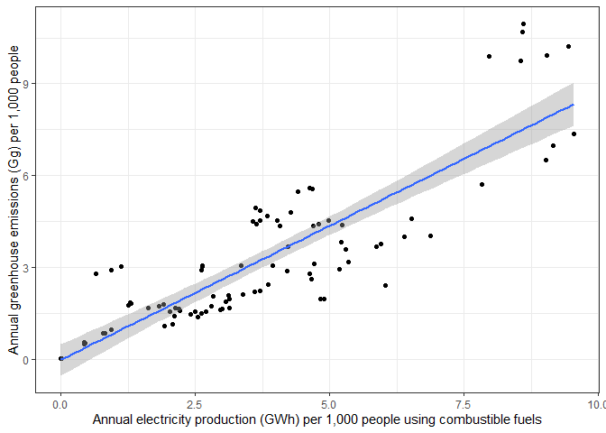
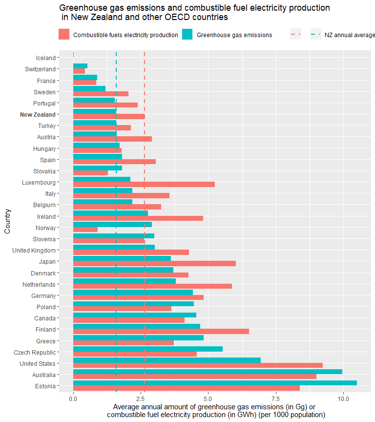
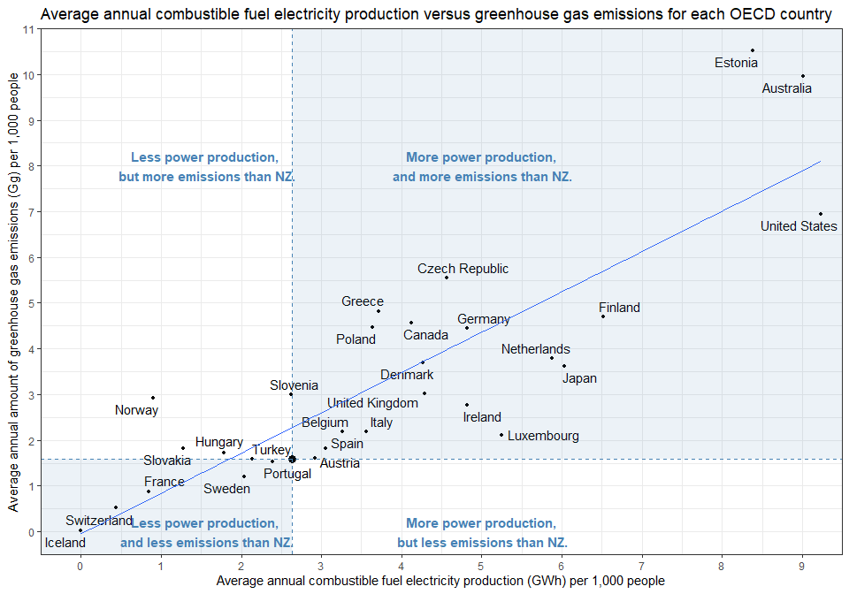

## Greenhouse gas emissions and combustible fuel electricity production in New Zealand and other OECD countries

### Disclaimer

This blog post was from a written exercise from my previous job
application. This post aims to demonstrate the process of data
manipulation, analysis, and visualisation using the R programming
language as the underlying data is considered outdated.

Source code can be founded in
<https://github.com/kcha193/Greenhouse_Effect>

### Executive Summary

-   Chart shows a strong positive relationship between annual
    combustible fuel electricity production and annual greenhouse gas
    emissions across 30 OECD countries.
-   Comparing across 30 OECD countries, New Zealand (NZ) ranked
    6th-lowest in greenhouse gas emissions and 11th-lowest in
    combustible fuel electricity production (per 1000 population per
    annum).

This analysis draws on three data sources: (1) OECD annual population
statistics, (2) International Energy Agency monthly electricity
statistics, and (3) Energy Industries yearly greenhouse gas emissions
**between 2010 and 2012**. This report describes the link between
average annual greenhouse gas emissions (in gigagram; Gg) and
combustible fuel electricity production (in gigawatts hour; GWh) per
1000 population across OECD countries, and then compares NZ rates with
rates from other OECD countries.

Across OECD countries, the analysis identifies extremely strong evidence
that as annual combustible fuel electricity production increases; the
amount of annual greenhouse gas emissions also increases. We estimate
that for every one GWh increase in the former, the latter increases by
0.876 Gg (per 1000 population).

The chart shows the annual average levels of the greenhouse gas
emissions versus combustible fuel electricity production for NZ and
other OECD countries. NZ generates greenhouse gas emissions of 1.58 Gg
per 1000 population each year (shown by blue horizontal dashed line) and
combustible fuel electricity production of 2.63 GWh per 1000 population
each year (shown by blue vertical dashed line), which are both
significantly lower than countries like Australia, the United States,
and the United Kingdom. On both measures, only Iceland, Switzerland and
France ranked significantly better. NZ appears to produce significantly
more power (per 1000 population) using combustible fuels than Norway,
Slovakia and Hungary, but generates less greenhouse gas emissions (per
1000 population) than these countries.

### Load the required packages

``` r
library(countrycode)
library(broom)
library(knitr)
library(ggrepel)
library(tidyverse)
```

# Extract datasets

These datasets were converted to CSV for importing.

``` r
pop_raw <- read_csv("data/DP_LIVE_01062019092109456.csv")
Carbon_Gg_emissions_raw <- read_csv("data/GHGs from Energy Industries.csv")
power_usage_raw <- read_csv("data/Monthly Electricity Statistics.csv")
```

## Clean-up the power_usage dataset

``` r
power_usage_by_country_year <- 
  power_usage_raw %>% 
  separate(Index, c("Country", "Type", "Fuel_Type"), sep = "\\." ) %>% 
  filter(Fuel_Type == "THERMAL") %>% 
  select(-Type) %>% 
  gather(key = month_year, val = Energy_GWh, -Country, -Fuel_Type ) %>% 
  separate(month_year, c("Month", "Year"), sep = "-" ) %>% 
  group_by(Country, Fuel_Type, Year) %>%
  summarise(Energy_GWh = sum(Energy_GWh, na.rm = TRUE)) %>% 
  ungroup() %>% 
  mutate(Country = if_else(Country == "NETHLAND", "NETHERLA",  
                           if_else(Country == "KOREA", "SOUTH KO", Country)))
```

## Clean-up the Carbon_Gg_emissions_raw dataset

``` r
Carbon_Gg_emissions_by_country_year <- 
  Carbon_Gg_emissions_raw %>% 
  select(Country, `2010`:`2012`) %>% 
  gather(key = Year, val = Carbon_Gg, -Country)  %>% 
  mutate(
    Country_label = Country,
    Country = toupper(str_sub(Country, 1, 8)),
    Year = str_sub(Year, 3, 4)) %>% 
  mutate(Country = 
           if_else(Country == "CZECH RE", "CZECH",
                   if_else(Country == "NEW ZEAL", "NZ",  
                           if_else(Country == "UNITED K", "UK", 
                                   if_else(Country == "UNITED S", "USA",
                                           if_else(Country == "SWITZERL",
                                                   "SWITLAND", Country)))))) 
```

## Clean-up the population dataset

``` r
pop_by_country_year <- 
  pop_raw %>% 
  select(LOCATION, TIME, Value) %>% 
  rename(Country = LOCATION, 
         Year = TIME) %>% 
  mutate(Country = countrycode(Country, "iso3c", "country.name", warn = FALSE),
         Pop = Value * 1e6 ) %>% 
  mutate(Country = toupper(str_sub(Country, 1, 8)),
         Year = str_sub(Year, 3, 4)) %>% 
  mutate(Country = 
           if_else(Country == "CZECH RE", "CZECH",
                   if_else(Country == "NEW ZEAL", "NZ",  
                           if_else(Country == "UNITED K", "UK", 
                                   if_else(Country == "UNITED S", "USA",
                                           if_else(Country == "SWITZERL", "SWITLAND",
                                                   if_else(Country == "CZECHIA", 
                                                           "CZECH", Country)))))))
```

## Combined the three datasets by country name

And standardised the measurements to per 1000 person. The country code
are joined based on the power usage dataset, which is the first 8 upper
case letter of the country name.

``` r
dat_combined <- 
  power_usage_by_country_year %>% 
  inner_join(Carbon_Gg_emissions_by_country_year) %>% 
  inner_join(pop_by_country_year) %>% 
  mutate(Energy_GWh_perC = Energy_GWh/Pop * 1000,
         Carbon_Gg_perC = Carbon_Gg/Pop * 1000)
```

This dataframe contains the non-matching country codes, so I can
manually correct the names of countries for merging.

``` r
check_nonmatching_countries <-
  power_usage_by_country_year %>%
  select(Country, Energy_GWh, Year) %>%
  full_join(Carbon_Gg_emissions_by_country_year %>%
              select(Country, Carbon_Gg, Year)) %>%
  full_join(pop_by_country_year %>%
              select(Country, Pop, Year)) %>% 
  mutate(Energy_GWh = is.na(Energy_GWh),
         Carbon_Gg = is.na( Carbon_Gg),
         Pop = is.na(Pop)) %>% 
  distinct(Country, Energy_GWh, Carbon_Gg, Pop) %>% 
  filter(Energy_GWh | Carbon_Gg|Pop)
```

## Linear regression to estimate the trend

Modeling for combustible fuel electricity production and the amount of
greenhouse gas emissions

``` r
fit <- lm(Carbon_Gg_perC ~ Energy_GWh_perC, dat_combined )
summary(fit)
```

    ## 
    ## Call:
    ## lm(formula = Carbon_Gg_perC ~ Energy_GWh_perC, data = dat_combined)
    ## 
    ## Residuals:
    ##     Min      1Q  Median      3Q     Max 
    ## -2.8553 -0.9284 -0.1709  0.7541  3.4338 
    ## 
    ## Coefficients:
    ##                 Estimate Std. Error t value Pr(>|t|)    
    ## (Intercept)     -0.02207    0.25505  -0.087    0.931    
    ## Energy_GWh_perC  0.87577    0.05677  15.427   <2e-16 ***
    ## ---
    ## Signif. codes:  0 '***' 0.001 '**' 0.01 '*' 0.05 '.' 0.1 ' ' 1
    ## 
    ## Residual standard error: 1.278 on 88 degrees of freedom
    ## Multiple R-squared:  0.7301, Adjusted R-squared:  0.727 
    ## F-statistic:   238 on 1 and 88 DF,  p-value: < 2.2e-16

The analysis identifies extremely strong evidence that as annual
combustible fuel electricity production increases by 1 GWh, The amount
of annual greenhouse gas emissions also increases by 0.87577 Gg.

## Figure Electricity production using combustible fuels versus Greenhouse emissions

``` r
ggplot(dat_combined, aes(x = Energy_GWh_perC, y = Carbon_Gg_perC)) +
  geom_point() +
  labs(x = "Annual electricity production (GWh) per 1,000 people using combustible fuels",
       y = "Annual greenhouse emissions (Gg) per 1,000 people") +
  geom_smooth(method = "lm") +
  theme_bw()
```



Decided not to use this plot for the presentaion, even though it shows a
positive linear trend but it does not help in comparing NZ against other
countries.

## One way ANOVA comparing against NZ

### Set NZ as reference group for comparison

``` r
country_list <- unique(dat_combined$Country_label)

dat_combined$Country_label <- 
  factor(dat_combined$Country_label, 
         levels = c("New Zealand" ,
                    country_list[country_list != "New Zealand" ]))
```

### Fitting models to compare against NZ

The average Greenhouse gas emissions and combustible fuel electricity
production of NZ against other OECD countries per year

``` r
fit_Carbon_Gg <- lm(Carbon_Gg_perC ~ Country_label,
                    dat_combined)
```

### Difference of average Greenhouse gas emissions of other countries against NZ

``` r
tidy(fit_Carbon_Gg) %>% 
  arrange(estimate) 
```

    ## # A tibble: 30 x 5
    ##    term                     estimate std.error statistic      p.value
    ##    <chr>                       <dbl>     <dbl>     <dbl>        <dbl>
    ##  1 Country_labelIceland      -1.56       0.236   -6.61   0.0000000116
    ##  2 Country_labelSwitzerland  -1.07       0.236   -4.52   0.0000294   
    ##  3 Country_labelFrance       -0.701      0.236   -2.97   0.00427     
    ##  4 Country_labelSweden       -0.382      0.236   -1.62   0.111       
    ##  5 Country_labelPortugal     -0.0516     0.236   -0.219  0.828       
    ##  6 Country_labelTurkey        0.0117     0.236    0.0495 0.961       
    ##  7 Country_labelAustria       0.0216     0.236    0.0913 0.928       
    ##  8 Country_labelHungary       0.142      0.236    0.602  0.549       
    ##  9 Country_labelSpain         0.229      0.236    0.968  0.337       
    ## 10 Country_labelSlovakia      0.234      0.236    0.990  0.326       
    ## # ... with 20 more rows

NZ is significantly worse than Iceland, Switzerland and France in
average Greenhouse gas emissions.

``` r
fit_Energy_GWh <- lm(Energy_GWh_perC ~  Country_label,
                     dat_combined )
```

### Difference of average combustible fuel electricity production of other countries against NZ

``` r
tidy(fit_Energy_GWh) %>% 
  arrange(estimate) 
```

    ## # A tibble: 30 x 5
    ##    term                     estimate std.error statistic  p.value
    ##    <chr>                       <dbl>     <dbl>     <dbl>    <dbl>
    ##  1 Country_labelIceland      -2.63       0.343   -7.68   1.71e-10
    ##  2 Country_labelSwitzerland  -2.20       0.343   -6.42   2.45e- 8
    ##  3 Country_labelFrance       -1.79       0.343   -5.21   2.41e- 6
    ##  4 Country_labelNorway       -1.73       0.343   -5.05   4.38e- 6
    ##  5 Country_labelSlovakia     -1.35       0.343   -3.95   2.06e- 4
    ##  6 Country_labelHungary      -0.846      0.343   -2.47   1.63e- 2
    ##  7 Country_labelSweden       -0.596      0.343   -1.74   8.68e- 2
    ##  8 Country_labelTurkey       -0.494      0.343   -1.44   1.55e- 1
    ##  9 Country_labelPortugal     -0.242      0.343   -0.706  4.83e- 1
    ## 10 Country_labelSlovenia     -0.0135     0.343   -0.0394 9.69e- 1
    ## # ... with 20 more rows

NZ is significantly worse than Iceland, Switzerland, France, Norway,
Slovakia, and Hungary in average combustible fuel electricity
production.

## Fitting models

To estimate the average Greenhouse gas emissions and combustible fuel
electricity production for different countries per year for the chart.

``` r
fit_Carbon_Gg <- lm(Carbon_Gg_perC ~ 0 + Country_label, dat_combined)

fit_Energy_GWh <- lm(Energy_GWh_perC ~  0 + Country_label, dat_combined )
```

## Barchart comparing between countries

Extracting the average annual Greenhouse gas emissions and combustible
fuel electricity production for each country. Then stacking the results
of annual Greenhouse gas emissions and combustible fuel electricity
production for plotting

``` r
dat_plot <- 
  list("Greenhouse gas emissions" = 
         fit_Carbon_Gg,
       "Combustible fuels electricity production" = 
         fit_Energy_GWh) %>% 
  map(function(x) tidy(x) %>% 
        filter(!term %in% c("(Intercept)"))%>% 
        mutate(term = str_replace(term, "Country_label", ""))  %>%
        mutate(Country = fct_reorder(term, estimate, .desc = TRUE))) %>% 
  bind_rows(.id = "Type") 
```

### Reference lines for average measures for NZ

``` r
ref_line <- 
  list( " " = tidy(fit_Energy_GWh)[1,2],
        "NZ annual average" = tidy(fit_Carbon_Gg)[1,2]) %>% 
  bind_rows(.id = "Type") 
```

### Side-by-side bar-plot comparing the annual Greenhouse gas emissions and combustible fuel electricity production between 30 OECD countries

``` r
g <- 
  ggplot(dat_plot, aes(x =  Country, y = estimate, fill = Type)) + 
  geom_col(position = "dodge") + 
  geom_hline(aes(yintercept = estimate, col = Type), data = ref_line,
             linetype = "dashed", size = 1) +
  labs(title = "Greenhouse gas emissions and combustible fuel electricity production \n in New Zealand and other OECD countries",
    y = "Average annual amount of greenhouse gas emissions (in Gg) or \n combustible fuel electricity production (in GWh) (per 1000 population)",
    fill = "", col = "") + 
  coord_flip() +  
  #theme_bw()+ 
  theme(legend.position = "top",
        axis.text.y =
          element_text(
            face =ifelse(levels(dat_plot$Country) ==
                           "New Zealand", "bold", "plain"))) 

g
```



Decided not to use it, because the association between the average
annual Greenhouse gas emissions and combustible fuels electricity
production is not obvious in this plot.

## Scatterplot comparing between countries

Scatterplot shows the annual average levels of the greenhouse gas
emissions versus combustible fuel electricity production for NZ and
other OECD countries.

Re-extracting the average annual Greenhouse gas emissions and
combustible fuel electricity production for each country for the final
chart

``` r
Carbon_Gg_average <- 
  tidy(fit_Carbon_Gg) %>% 
  select(term, estimate) %>% 
  filter(!term %in% c("(Intercept)"))%>% 
  mutate(term = str_replace(term, "Country_label", "") )%>% 
  rename(Country = term, 
         Carbon_Gg = estimate)


Carbon_Gg_average %>% 
  arrange(Carbon_Gg) %>% 
  print(n=Inf)
```

    ## # A tibble: 30 x 2
    ##    Country        Carbon_Gg
    ##    <chr>              <dbl>
    ##  1 Iceland           0.0219
    ##  2 Switzerland       0.515 
    ##  3 France            0.881 
    ##  4 Sweden            1.20  
    ##  5 Portugal          1.53  
    ##  6 New Zealand       1.58  
    ##  7 Turkey            1.59  
    ##  8 Austria           1.60  
    ##  9 Hungary           1.72  
    ## 10 Spain             1.81  
    ## 11 Slovakia          1.82  
    ## 12 Luxembourg        2.11  
    ## 13 Italy             2.18  
    ## 14 Belgium           2.19  
    ## 15 Ireland           2.78  
    ## 16 Norway            2.92  
    ## 17 Slovenia          3.00  
    ## 18 United Kingdom    3.02  
    ## 19 Japan             3.62  
    ## 20 Denmark           3.70  
    ## 21 Netherlands       3.79  
    ## 22 Germany           4.44  
    ## 23 Poland            4.48  
    ## 24 Canada            4.56  
    ## 25 Finland           4.71  
    ## 26 Greece            4.82  
    ## 27 Czech Republic    5.54  
    ## 28 United States     6.95  
    ## 29 Australia         9.96  
    ## 30 Estonia          10.5

NZ ranked 6th with 1.58 Gg

``` r
Energy_GWh_average <- 
  tidy(fit_Energy_GWh)  %>% 
  select(term, estimate) %>% 
  filter(!term %in% c("(Intercept)"))%>% 
  mutate(term = str_replace(term, "Country_label", "") )%>% 
  rename(Country = term, 
         Energy_GWh = estimate)

Energy_GWh_average%>% 
  arrange(Energy_GWh) %>% 
  print(n=Inf)
```

    ## # A tibble: 30 x 2
    ##    Country        Energy_GWh
    ##    <chr>               <dbl>
    ##  1 Iceland           0.00104
    ##  2 Switzerland       0.434  
    ##  3 France            0.847  
    ##  4 Norway            0.902  
    ##  5 Slovakia          1.28   
    ##  6 Hungary           1.79   
    ##  7 Sweden            2.04   
    ##  8 Turkey            2.14   
    ##  9 Portugal          2.39   
    ## 10 Slovenia          2.62   
    ## 11 New Zealand       2.63   
    ## 12 Austria           2.92   
    ## 13 Spain             3.06   
    ## 14 Belgium           3.26   
    ## 15 Italy             3.56   
    ## 16 Poland            3.64   
    ## 17 Greece            3.72   
    ## 18 Canada            4.12   
    ## 19 Denmark           4.27   
    ## 20 United Kingdom    4.29   
    ## 21 Czech Republic    4.57   
    ## 22 Ireland           4.82   
    ## 23 Germany           4.82   
    ## 24 Luxembourg        5.25   
    ## 25 Netherlands       5.88   
    ## 26 Japan             6.03   
    ## 27 Finland           6.52   
    ## 28 Estonia           8.39   
    ## 29 Australia         9.01   
    ## 30 United States     9.24

NZ ranked 11th with 2.63 GWh

``` r
dat_plot <- 
  Energy_GWh_average %>%
  full_join(Carbon_Gg_average) %>% 
  mutate(Country = factor(Country))
```

### Final product

``` r
g <- 
  ggplot(dat_plot, aes(x =  Energy_GWh, y = Carbon_Gg, 
                       label = Country)) + 
  geom_point(size =  ifelse(dat_plot$Country == "New Zealand", 3, 1)) + 
  geom_text_repel(
    size =  ifelse(dat_plot$Country == "New Zealand", 5, 4),
    fontface = ifelse(dat_plot$Country == "New Zealand", "bold", "plain")) +
  labs(title = 
         "Average annual combustible fuel electricity production versus greenhouse gas emissions for each OECD country",
       x = "Average annual combustible fuel electricity production (GWh) per 1,000 people",
       y = "Average annual amount of greenhouse gas emissions (Gg) per 1,000 people") +
  geom_smooth(method = "lm", se = FALSE, size = .5) +
  geom_hline(yintercept = as.numeric(dat_plot[1,3]),
             linetype = "dashed", col = "steelblue") +
  geom_vline(xintercept = as.numeric(dat_plot[1,2]),
             linetype = "dashed", col = "steelblue") + 
  annotate("rect", xmin = -0.5, xmax = as.numeric(dat_plot[1,2]),  
                    ymin = -0.5, ymax = as.numeric(dat_plot[1,3]),  
           fill = "steelblue", alpha = 0.1)+
  annotate("rect", xmin = as.numeric(dat_plot[1,2]) , xmax = 9.5,  
           ymin = as.numeric(dat_plot[1,3]), ymax = 11,  
           fill = "steelblue", alpha = 0.1)+
  annotate("text", x = 1.55, y = 8, size = 4, col = "steelblue", fontface = "bold",
           label = "Less power production,\n but more emissions than NZ.") +
  annotate("text", x = 1.55, y = 0, size = 4, col = "steelblue",  fontface = "bold",
           label = "Less power production,\n and less emissions than NZ.") +
  annotate("text", x = 5, y = 8, size = 4, col = "steelblue",  fontface = "bold",
           label = "More power production,\n and more emissions than NZ.") +
  annotate("text", x = 5, y = 0, size = 4, col = "steelblue",  fontface = "bold",
           label = "More power production,\n but less emissions than NZ.") +
  scale_x_continuous(breaks = seq(0, 9.5, by = 1), expand = c(0,0), limits = c(-0.5, 9.5)) + 
  scale_y_continuous(breaks = seq(0, 11, by = 1), expand = c(0,0), limits = c(-0.5, 11)) + 
  theme_bw()

g
```



### Notes:

-   The point and Font size for NZ have been made bigger.
-   geom_text_repel function is to avoid overlapping of the country
    names.
-   Smoother with linear regression line to show the positive linear
    association.
-   Horizontal and vertical lines allow the reader to compare against
    measures for NZ.
-   Annotate function allows me to have shading and write text on the
    plot in specific area.
-   The continuous scales for both x and y axis are adjusted to 1 unit
    break.
-   Lastly, I used black and white theme, so it is easier to read.

## Data source

-   Population Statistics: <https://data.oecd.org/pop/population.htm>
-   Greenhouse Gas Emissions from Energy Industries:
    <http://unfccc.int/files/ghg_emissions_data/application/x-zip-compressed/ai_energy_industries.zip>
